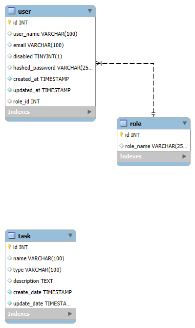

# RADAssessment
This project is a backend application built using FastAPI and MySQL, designed to handle various functionalities as outlined in the ER diagram. It offers a RESTful API for interacting with a set of resources.

## ER Diagram

[](er_diagram.png)

## Prerequisites

Before using this project, ensure you have the following:

- Python 3.11 <
- MySQL 8.0

## How to use

1. Clone this repository to your local machine.

    ```bash
      git clone <repo link>
      cd <repo name>
    ```

2. Install the requirements

    ```
        pip3 install -r requirements.txt
    ```

3. Create `.env` file using `.env.example` file and set the values

4. Run the `main.py` file

## API Documentation

- Swagger UI -> http://localhost:8000/docs
- ReDoc -> http://localhost:8000/redoc

## Tech Stack

- Python3
- Docker
- FastAPI
- MySQL

## License

This RADAssessment repo is licensed under the following License details.

- [Pathum Herath](https://github.com/PHerath)

## Authors

If you have any questions or need further assistance, you can reach out to

- [Pathum Herath](https://github.com/PHerath)
